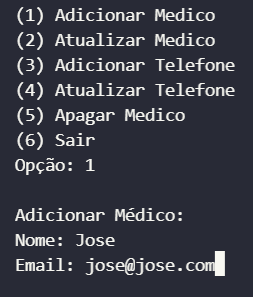

# Banco-Hospital-MySql
## MySql junto com Python

1. Adicionar Médico, atualizar e apagar dados(id, nome, email).

2. Adicionar Telefone e atualizar dados. (id, numero, tipo: 'Comercial' 'Residencial' 'Celular').
3. Adicionar Paciente, atualizar e apagar dados(nome, cpf, email, sexo).
4. Adicionar Exame do paciente.
5. Adicionar os Medicamentos do paciente.
6. Adicionar Endereço do paciente e atualizar.
7. Adicionar o plano de saude do paciente.
8. Consulta que une com fk médico e o paciente.