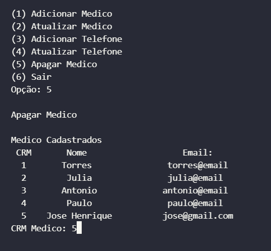
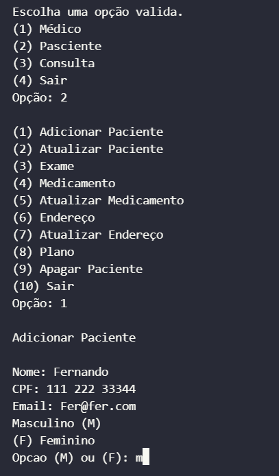
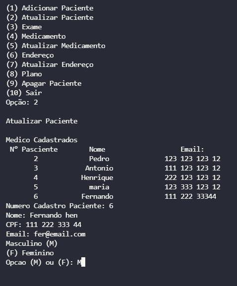
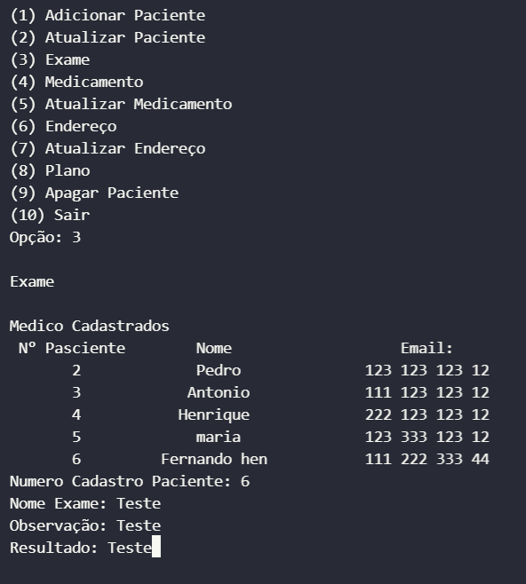
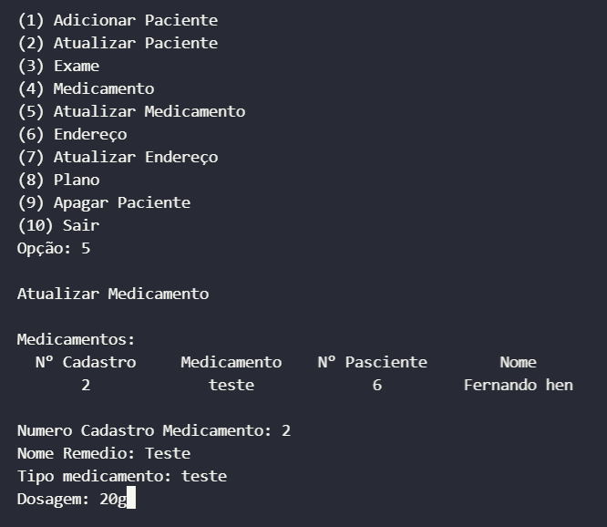
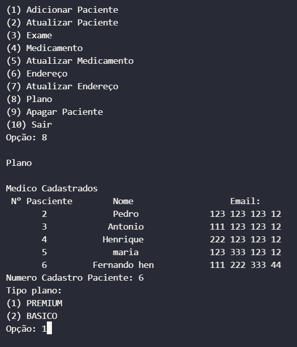

# Banco-Hospital-MySql
## MySql junto com Python

1. Adicionar Médico, atualizar e apagar dados(id, nome, email). 
 
 
 
 
2. Adicionar Telefone e atualizar dados. (id, numero, tipo: 'Comercial' 'Residencial' 'Celular'). 
 
 
3. Adicionar Paciente, atualizar e apagar dados(nome, cpf, email, sexo). 
 
 
4. Adicionar Exame do paciente. 
 
5. Adicionar os Medicamentos do paciente. 
 
 
6. Adicionar Endereço do paciente e atualizar. 
 
 
7. Adicionar o plano de saude do paciente. 
 
8. Consulta que une com fk médico e o paciente. 
 
 